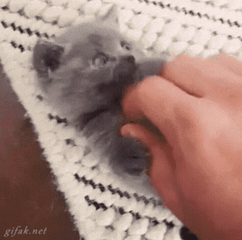

  

# Juan David Salas Camargo

Hola, soy Juan David: desarrollador backend en Colombia. Mi bio dice que soy
marcian, no lo desmiento.

Trabajo con Java y Spring Boot, y en las noches el teclado se me va hacia Godot,
el pixel art y experimentos que empiezan con "¿y si...?".

  

## En lo que ando ahora

- **open-civic-signal-os** — convertir señales ciudadanas en un backlog público que se pueda auditar.
- **free-subs** — subtítulos en español, inglés y mandarín que corren enteros en tu máquina.
- **harness-moon** — un sistema operativo de agentes local, con TDD y MCP.
- **odiseum** + **aseprite-asset-mcp** — un RPG cozy en Godot y la fábrica de pixel art que lo alimenta.

## Cosas que hice y me gusta cómo quedaron

- **sdd-tool** — un CLI que convierte requerimientos en specs, arquitectura, pruebas y documentación.
- **solvejs** — utilidades para JavaScript y TypeScript sin una sola dependencia.
- **muisca** — sandbox 2D con agricultura, estaciones y sociedades.
- **JuegoDefinitivo** — el RPG de la universidad que se negó a morir.
- **KombaOS** — inventarios y trazabilidad para talleres artesanales.
- **unad-centaurus** — el proyecto de la UNAD donde aprendí más de lo que esperaba.

## Con qué trabajo

Java · Spring Boot · TypeScript · React · Python · Godot · PostgreSQL · Docker · Git

## Fuera del teclado

Gatos, anime viejo, música de 8 bits y estudiar en la UNAD (estudiar y trabajar
a la vez sí es de valientes).

Fan de One Piece de la vieja escuela.

  
  

  

---

Si quieres hablar de backend, juegos o gatos: [LinkedIn](https://www.linkedin.com/in/jdsalasca/) · [GitHub](https://github.com/jdsalasca)

Y si algo de lo que hago te sirvió, puedes [invitarme un café](https://github.com/sponsors/jdsalasca).

Actualizado: septiembre de 2026 :paw_prints:
