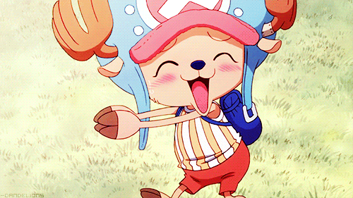
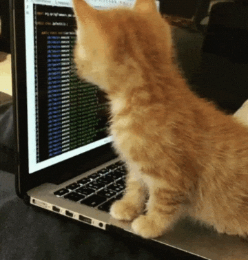
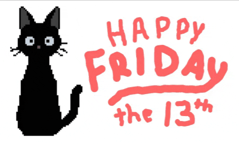

  
  <h1>Juan David Salas Camargo</h1>
  
Backend engineer building practical, production-ready open source for developers and product teams.

  

    
    
  

---

## About

I focus on backend systems with Java and Spring Boot, and I also build developer tooling that helps teams ship faster with fewer production issues.

My goal is simple: create tools that are easy to adopt, well-documented, and useful in real-world engineering work.

## Sponsor my open source

  

If my projects have helped your team save time, reduce bugs, or ship faster, sponsoring helps me keep this work sustainable.

Your sponsorship directly supports:

- Ongoing maintenance and faster fixes.
- Better documentation and production examples.
- New features prioritized by community demand.
- Long-term support for free, open tools.

## Tech stack (based on my repos)

  
  
  
  
  
  
  
  
  
  

## Stats

  

## Activity Snapshot

  

## Old-school One Piece corner

  
  
  

## Contact

- LinkedIn: https://www.linkedin.com/in/jdsalasca/
- GitHub: https://github.com/jdsalasca
- Sponsors: https://github.com/sponsors/jdsalasca